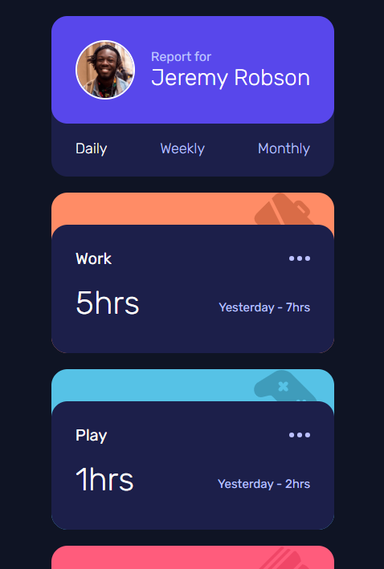

# Frontend Mentor - Time tracking dashboard solution

This is a solution to the [Time tracking dashboard challenge on Frontend Mentor](https://www.frontendmentor.io/challenges/time-tracking-dashboard-UIQ7167Jw). Frontend Mentor challenges help you improve your coding skills by building realistic projects. 

## Table of contents

- [Overview](#overview)
  - [The challenge](#the-challenge)
  - [Screenshot](#screenshot)
  - [Links](#links)
- [My process](#my-process)
  - [Built with](#built-with)
  - [What I learned](#what-i-learned)

## Overview

### The challenge

Users should be able to:

- View the optimal layout for the site depending on their device's screen size
- See hover states for all interactive elements on the page
- Switch between viewing Daily, Weekly, and Monthly stats

### Screenshot

- desktop screentshot


- tablet screentshot


- mobile screentshot



### Links

- Solution URL: [https://github.com/Binh05/time-tracking-dashboard](https://github.com/Binh05/time-tracking-dashboard)
- Live Site URL: [https://binh05.github.io/time-tracking-dashboard/](https://binh05.github.io/time-tracking-dashboard/)

## My process

### Built with

- Semantic HTML5 markup
- CSS custom properties
- Flexbox
- CSS Grid
- Mobile-first workflow
- Javascript Fundamentals

### What I learned

I learned how to use fetch api to get and set data inner html

To see how you can add code snippets, see below:

```js
fetch('data.json')
.then((res) => res.json())
.then((data) => {
    let previous
    switch (timeFrameName) {
        case 'daily':
            previous = 'Yesterday'
            break;
        case 'weekly':
            previous = 'Last Week'
            break;
        case 'monthly':
            previous = 'Last Month'
    }
    changeData(data, timeFrameName, previous)
})
```